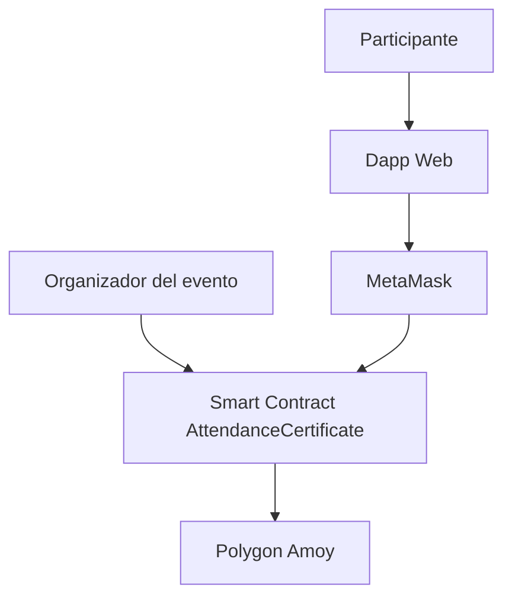

# blockchain-event-certificates

Sistema de certificados de asistencia en blockchain inspirado en POAP, implementado con smart contracts propios en Solidity, una Dapp web con MetaMask y despliegue en Polygon Amoy.

## Descripción del sistema

Este proyecto propone una solución para emitir certificados de asistencia verificables en eventos académicos, talleres, webinars o conferencias. En lugar de depender de certificados tradicionales fácilmente falsificables, el sistema permite que cada participante reclame por sí mismo un certificado digital mediante su wallet y un claim code único.

La solución toma inspiración conceptual de POAP, pero implementa un flujo simplificado con smart contracts propios. El organizador crea el evento y carga hashes de códigos únicos, mientras que el participante conecta su wallet con MetaMask y reclama su certificado directamente desde la Dapp.

El objetivo principal del sistema es demostrar cómo blockchain puede utilizarse para crear pruebas de asistencia verificables, trazables y resistentes a manipulación, manteniendo una experiencia de usuario relativamente simple y comprensible dentro del alcance de un MVP académico.

## Problema que resuelve

Los certificados de asistencia tradicionales presentan varios problemas:

- pueden ser falsificados o alterados
- no existe una forma simple de verificar autenticidad
- suelen depender por completo de un emisor centralizado
- el participante normalmente no controla el certificado de forma directa
- la validación posterior del certificado suele ser manual

Este proyecto propone un mecanismo de reclamo on-chain donde el participante usa su propia wallet para reclamar un certificado único, usando un claim code previamente distribuido por el organizador.

## Solución propuesta

La solución implementa un flujo descentralizado de reclamo de certificados:

1. El organizador despliega el contrato inteligente.
2. El organizador crea un evento.
3. El organizador carga hashes de claim codes únicos.
4. El participante recibe un código por un canal externo (correo, QR o similar).
5. El participante abre la Dapp y conecta MetaMask.
6. El participante ingresa el `eventId`, el `claimCode` y un `tokenURI`.
7. El contrato valida el código y emite el certificado si el reclamo es válido.
8. La Dapp permite verificar si una wallet ya reclamó o no.

## Arquitectura

La arquitectura mínima del sistema está compuesta por los siguientes elementos:

1. **Organizador del evento**  
   Responsable de desplegar el contrato, crear eventos y registrar los hashes de claim codes válidos.

2. **Smart contract `AttendanceCertificate`**  
   Contrato principal del sistema. Gestiona la creación de eventos, la carga de códigos válidos, la validación del reclamo y la emisión del certificado.

3. **Dapp web**  
   Interfaz de usuario desarrollada para permitir la conexión de MetaMask, el reclamo del certificado y la verificación del estado de una wallet.

4. **MetaMask**  
   Wallet del participante utilizada para firmar transacciones e interactuar con el contrato.

5. **Polygon Amoy**  
   Red de testnet donde se despliega el contrato para la entrega final.

## Flujo de transacciones

El flujo funcional del sistema es el siguiente:

1. Se despliega el contrato `AttendanceCertificate` en la red correspondiente.
2. El organizador crea un evento mediante el contrato.
3. El organizador carga hashes de claim codes asociados al evento.
4. El participante abre la Dapp y conecta MetaMask.
5. La Dapp detecta la red activa y carga la dirección del contrato desde `web/config.json`.
6. El participante ingresa:
   - `eventId`
   - `claimCode`
   - `tokenURI`
7. La Dapp llama la función `claimCertificate(...)`.
8. El contrato verifica:
   - que el evento exista y esté activo
   - que el código sea válido
   - que el código no haya sido usado antes
   - que la wallet no haya reclamado previamente
9. Si todas las validaciones pasan, el contrato registra el reclamo y emite el certificado.
10. El participante puede usar la Dapp para consultar si ya reclamó.

## Diagrama de componentes

## Diagrama de flujo de transacciones 

sequenceDiagram

    participant O as Organizador
    participant C as Contrato
    participant U as Usuario
    participant D as Dapp
    participant M as MetaMask
    participant A as Polygon Amoy

    O->>C: Crear evento
    O->>C: Cargar hash de claim code
    U->>D: Abrir Dapp
    U->>M: Conectar wallet
    D->>C: Cargar dirección del contrato
    U->>D: Ingresar eventId, claimCode y tokenURI
    D->>M: Solicitar firma de transacción
    M->>C: claimCertificate(...)
    C->>A: Registrar reclamo y emitir certificado
    D->>C: Consultar hasClaimed(...)
    C-->>D: Retornar estado del reclamo

### El contrato principal es AttendanceCertificate.sol.

Sus funciones clave son:
	•	createEvent(string name)
	•	addClaimCode(uint256 eventId, bytes32 codeHash)
	•	addClaimCodes(uint256 eventId, bytes32[] memory codeHashes)
	•	claimCertificate(uint256 eventId, string memory code, string memory tokenURI_)
	•	hasClaimed(uint256 eventId, address attendee)
	•	closeEvent(uint256 eventId)

### Dapp

La interfaz web fue desarrollada para permitir que el usuario interactúe con el contrato usando MetaMask. Las funcionalidades implementadas son:
	•	conectar wallet
	•	detectar la red activa
	•	resolver la dirección del contrato desde web/config.json
	•	reclamar un certificado con claim code
	•	verificar si la wallet ya reclamó

## Estructura del proyecto 

	•	contracts/AttendanceCertificate.sol: contrato principal del sistema
	•	contracts/AttendanceRegistry.sol: contrato previo de la iteración anterior
	•	test/AttendanceCertificate.test.ts: pruebas unitarias del contrato final
	•	test/AttendanceRegistry.test.ts: pruebas del contrato anterior
	•	scripts/deploy.js: despliegue del contrato y actualización de web/config.json
	•	scripts/setupEvent.js: creación de evento y carga de claim code para pruebas/demostración
	•	web/index.html: interfaz web de la Dapp
	•	web/app.js: lógica de frontend
	•	web/config.json: direcciones del contrato por red
	•	hardhat.config.ts: configuración de Hardhat para local y Amoy
	•	metadata/: recursos relacionados con metadatos del certificado
	•	frontend/: carpeta adicional de frontend mantenida durante el desarrollo
	•	README.md: documentación general del proyecto

## Alcance del proyecto

El proyecto actualmente permite:
	•	desplegar el contrato
	•	crear eventos
	•	cargar claim codes
	•	reclamar certificados con wallet
	•	verificar reclamos desde la Dapp
	•	operar tanto en entorno local como en Polygon Amoy

## Limitaciones 

	•	la preparación del evento todavía se realiza por script del organizador
	•	no existe una interfaz administrativa completa para crear eventos desde la web
	•	el sistema está planteado como MVP funcional académico
	•	la experiencia visual del certificado puede mejorarse en iteraciones futuras
