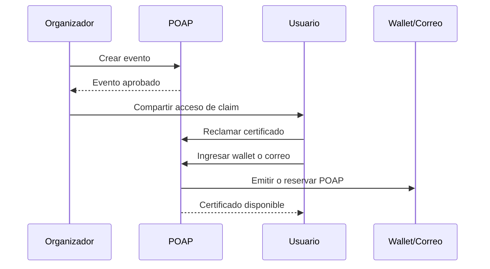
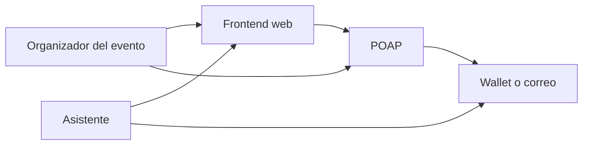
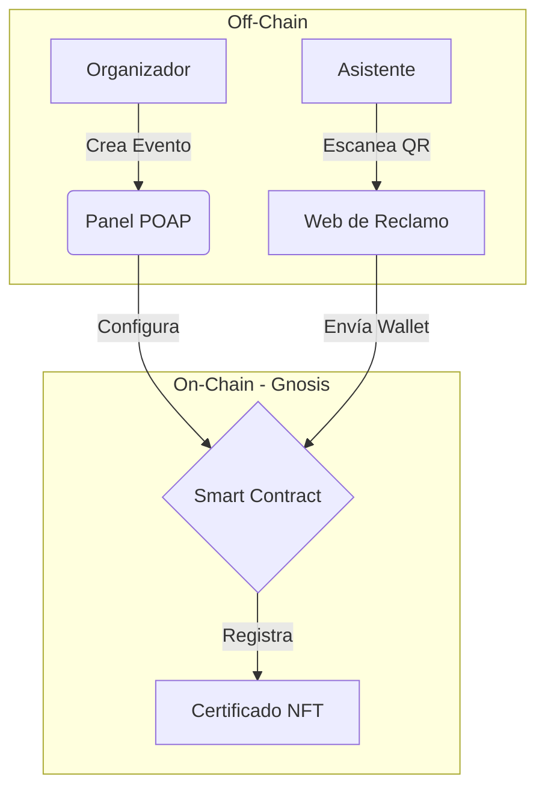

# blockchain-event-certificates

Minimal blockchain architecture project for event attendance certificates using POAP.

## Descripción del sistema

Este proyecto propone una solución mínima para la emisión de certificados de asistencia a eventos utilizando POAP (Proof of Attendance Protocol). El objetivo es representar la asistencia de una persona a un evento académico, charla, taller, webinar o conferencia mediante un certificado digital verificable.

En lugar de desarrollar un contrato inteligente propio, la solución reutiliza la infraestructura de POAP como protocolo especializado en certificados de asistencia. De esta forma, se reduce la complejidad técnica del prototipo y se enfoca el proyecto en el análisis de arquitectura, el flujo de transacciones y la interacción entre componentes.

El sistema está diseñado para que un organizador cree un evento, habilite un método de distribución del certificado y permita que los asistentes reclamen su comprobante digital al finalizar o durante la actividad.

## Arquitectura

La arquitectura mínima del sistema está compuesta por los siguientes elementos:

1. **Organizador del evento**  
   Responsable de crear el evento y configurar la distribución del certificado de asistencia.

2. **Frontend web**  
   Interfaz simple donde el asistente visualiza información del evento y accede al proceso de reclamo del certificado.

3. **POAP**  
   Protocolo que gestiona la creación del evento, la distribución del claim y la emisión del certificado digital.

4. **Asistente**  
   Usuario que participó en el evento y desea reclamar su certificado.

5. **Wallet o email**  
   Medio por el cual el asistente recibe o reserva el certificado.

## Flujo de transacciones

1. El organizador crea el evento de certificados de asistencia en POAP.
2. POAP revisa y aprueba el evento.
3. El organizador recibe el mecanismo de distribución del claim.
4. El asistente accede al enlace o flujo de reclamo desde la interfaz web.
5. El asistente ingresa su wallet o correo electrónico.
6. POAP emite o reserva el certificado digital de asistencia.
7. El asistente conserva el POAP como evidencia de participación en el evento.

## Diagrama de componentes

### Diagrama de Componentes Detallado

### Justificación de la Tecnología (Análisis de Capas)
Para una eficiente funcionalidad, se divide en tres capas técnicas:
* **Capa de Aplicación:** El asistente usa una interfaz web simple para reclamar su certificado sin necesidad de saber programar.
* **Capa de Red (Gnosis Chain):** Los certificados se emiten en esta red (una "sidechain" de Ethereum) por las facildiades que provee, permitiendo que el trámite sea gratuito.
* **Capa de Activos (NFT):** Cada certificado es un token **ERC-721**. Esto garantiza que cada asistencia sea única, no se pueda duplicar y sea propiedad total del que asiste al evento.

### Propiedades de Seguridad y Confianza
1. **Inmutabilidad:** Una vez emitido el POAP, nadie puede borrar el registro de que asististe al evento.
2. **Verificabilidad:** Cualquier empresa puede revisar tu wallet en un explorador de bloques (como GnosisScan) para confirmar que tu certificado es real.
3. **Prevención de Fraude:** Al usar enlaces únicos, se evita que personas que no estuvieron en la charla, evento, etc, obtengan el título.

